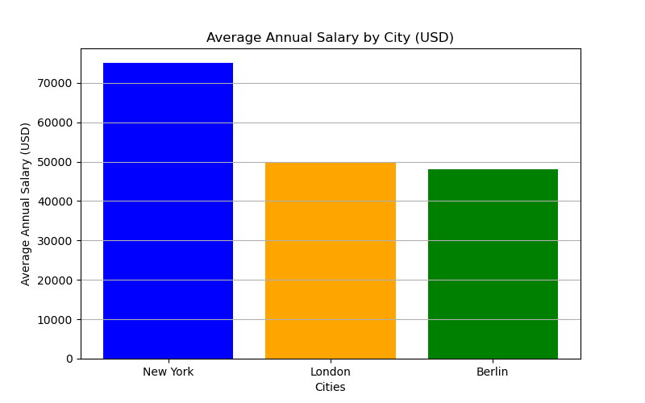

# Statistical Concepts for Data Analysis

Here I document some theoretical *concepts of statistics* related to *data analysis*.

The idea is to explain them in a simple way: concept → example, just for reference/consultation.

I hope this helps you :D

This repository is part of my portfolio.  

You can check out my professional background on [LinkedIn](https://www.linkedin.com/in/leonardo-oliveira-01801518a/).

**Feel free to explore and contribute!**

## 1. Concept of statistics

1.1. *Definition.* Statistics

You can think of it as the art of to transform data into knoledge. Its very usefull to help corporations make better decisions based on data. It can be used to analyze the past (descriptive) and also to predict the future (predictive), with high accuracy or lower error in some sense.

1.3. *Definition.* Descriptive statistics

By summarizing (often large amounts of) data, it provides a clear overview without making predictions or inferences about a larger population. It includes graphical visualizations, as well as well-known concepts like mean, median, and mode, among others.

Pure data like this

| City        | Average Annual Salary (USD) |
|---------------|---------------------------|
| New York     | $75,000                   |
| London       | $50,000                   |
| Berlim        | $48,000                   |

are easuer to see by looking at

1.4. *Definition.*
